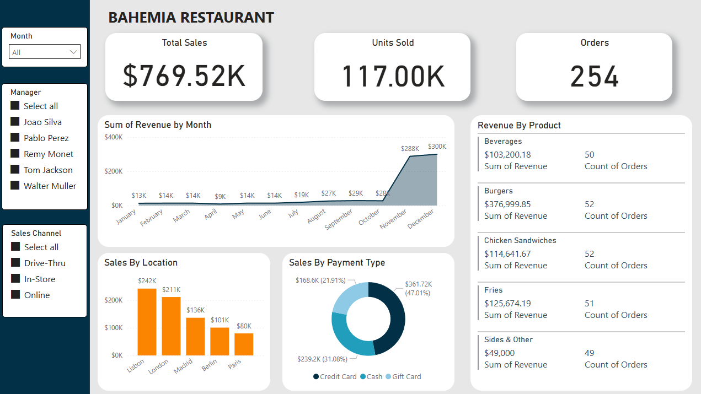

# Restaurant Sales Dashboard – Power BI

## Project Overview
This project is an interactive Power BI dashboard analyzing restaurant sales data across multiple cities, product categories, and sales channels. The goal was to identify key trends in revenue, product performance, and customer purchasing behavior, thereby supporting data-driven decision-making.

## Data Source
The dataset used in this project was obtained from [Kaggle – Restaurant Sales Data](https://www.kaggle.com/datasets/rohitgrewal/restaurant-sales-data/data).  
It contains transaction-level sales data including:
- Date of transaction
- Location
- Product sold
- Quantity and revenue
- Payment type
- Manager responsible
- Sales channel (Online, Drive-Thru, In-Store)

## Key Insights
- **Total Sales:** $769.52K across all locations

- **Top Cities by Sales:**

  1\. Lisbon – $242K  
  2\. London – $211K  
  3\. Madrid – $136K  
  4\. Berlin – $101K  
  5\. Paris – $80K  

- **Top-Selling Product:** Burgers (~$377.00K revenue, 52 orders)

- **Most Common Payment Method:** Credit Card (47% of total sales)

- **Peak Month:** December with ~$300K in revenue
## Interactive Filters - Slicers
This dashboard includes interactive slicers that allow dynamic filtering for deeper insights:

- **Month Slicer:** View sales trends for specific months or compare seasonal patterns.

- **Manager-Level Insights:** Dashboard filters allow analysis of revenue, product performance, and sales channel breakdown by individual manager, enabling performance comparisons between:
  - Joao Silva
  - Pablo Perez
  - Remy Monet
  - Tom Jackson
  - Walter Muller

- **Sales Channel Slicer:** Break down revenue and orders by purchase type:
  - Online
  - Drive-Thru
  - In-Store

## Tools Used
- **Power BI Desktop** – Data modeling & dashboard creation
- **Excel/CSV** – Initial dataset format from Kaggle and Data Cleaning

## Dashboard Preview

  
